# Complete Design Patterns Guide with Java Examples

## Table of Contents
1. [Creational Design Patterns](#creational-design-patterns)
2. [Structural Design Patterns](#structural-design-patterns)
3. [Behavioral Design Patterns](#behavioral-design-patterns)

---

## Creational Design Patterns

Creational patterns deal with object creation mechanisms, trying to create objects in a manner suitable to the situation.

### 1. Simple Factory Pattern

**Intent**: Creates objects without specifying the exact class to create.

**Real-world Example**: A pizza restaurant that creates different types of pizzas based on customer orders.

```java
// Product interface
interface Pizza {
    void prepare();
    void bake();
    void cut();
    void box();
}

// Concrete Products
class MargheritaPizza implements Pizza {
    public void prepare() { System.out.println("Preparing Margherita Pizza"); }
    public void bake() { System.out.println("Baking Margherita Pizza"); }
    public void cut() { System.out.println("Cutting Margherita Pizza"); }
    public void box() { System.out.println("Boxing Margherita Pizza"); }
}

class PepperoniPizza implements Pizza {
    public void prepare() { System.out.println("Preparing Pepperoni Pizza"); }
    public void bake() { System.out.println("Baking Pepperoni Pizza"); }
    public void cut() { System.out.println("Cutting Pepperoni Pizza"); }
    public void box() { System.out.println("Boxing Pepperoni Pizza"); }
}

// Simple Factory
class PizzaFactory {
    public static Pizza createPizza(String type) {
        switch (type.toLowerCase()) {
            case "margherita":
                return new MargheritaPizza();
            case "pepperoni":
                return new PepperoniPizza();
            default:
                throw new IllegalArgumentException("Unknown pizza type: " + type);
        }
    }
}

// Client
public class PizzaStore {
    public static void main(String[] args) {
        Pizza pizza = PizzaFactory.createPizza("margherita");
        pizza.prepare();
        pizza.bake();
        pizza.cut();
        pizza.box();
    }
}
```

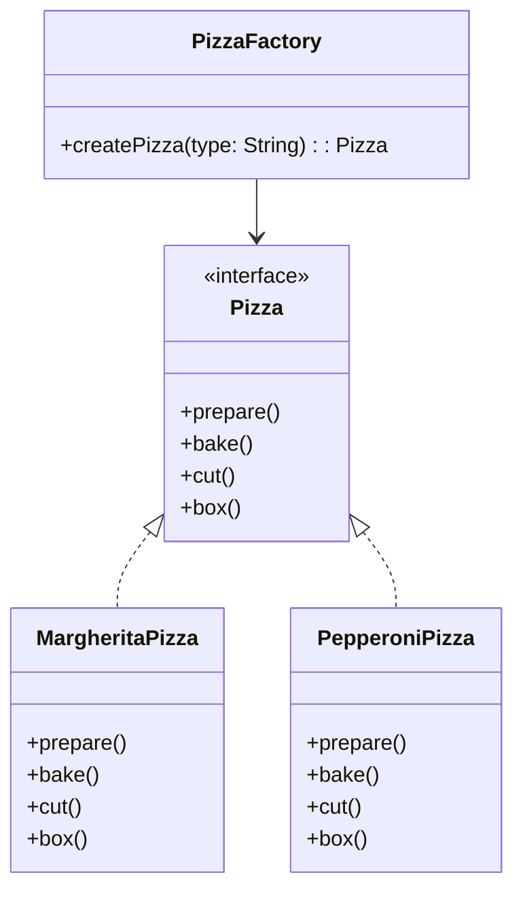

### 2. Factory Method Pattern

**Intent**: Creates objects through inheritance and lets subclasses decide which class to instantiate.

**Real-world Example**: Different vehicle manufacturers creating their specific types of vehicles.

```java
// Product interface
interface Vehicle {
    void start();
    void stop();
}

// Concrete Products
class Car implements Vehicle {
    public void start() { System.out.println("Car started"); }
    public void stop() { System.out.println("Car stopped"); }
}

class Motorcycle implements Vehicle {
    public void start() { System.out.println("Motorcycle started"); }
    public void stop() { System.out.println("Motorcycle stopped"); }
}

// Creator abstract class
abstract class VehicleFactory {
    public abstract Vehicle createVehicle();
    
    public void deliverVehicle() {
        Vehicle vehicle = createVehicle();
        vehicle.start();
        System.out.println("Vehicle delivered!");
        vehicle.stop();
    }
}

// Concrete Creators
class CarFactory extends VehicleFactory {
    public Vehicle createVehicle() {
        return new Car();
    }
}

class MotorcycleFactory extends VehicleFactory {
    public Vehicle createVehicle() {
        return new Motorcycle();
    }
}

// Client
public class VehicleManufacturer {
    public static void main(String[] args) {
        VehicleFactory carFactory = new CarFactory();
        carFactory.deliverVehicle();
        
        VehicleFactory motorcycleFactory = new MotorcycleFactory();
        motorcycleFactory.deliverVehicle();
    }
}
```

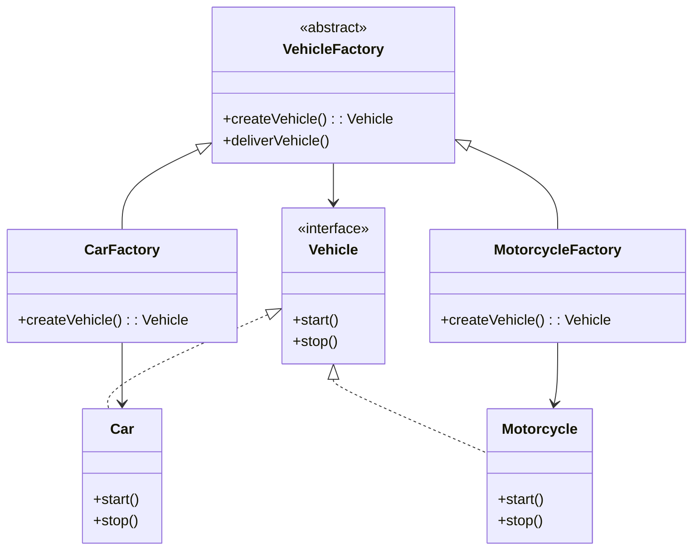

### 3. Abstract Factory Pattern

**Intent**: Provides an interface for creating families of related objects.

**Real-world Example**: Creating GUI components for different operating systems.

```java
// Abstract Products
interface Button {
    void render();
    void onClick();
}

interface Checkbox {
    void render();
    void toggle();
}

// Concrete Products for Windows
class WindowsButton implements Button {
    public void render() { System.out.println("Rendering Windows button"); }
    public void onClick() { System.out.println("Windows button clicked"); }
}

class WindowsCheckbox implements Checkbox {
    public void render() { System.out.println("Rendering Windows checkbox"); }
    public void toggle() { System.out.println("Windows checkbox toggled"); }
}

// Concrete Products for Mac
class MacButton implements Button {
    public void render() { System.out.println("Rendering Mac button"); }
    public void onClick() { System.out.println("Mac button clicked"); }
}

class MacCheckbox implements Checkbox {
    public void render() { System.out.println("Rendering Mac checkbox"); }
    public void toggle() { System.out.println("Mac checkbox toggled"); }
}

// Abstract Factory
interface GUIFactory {
    Button createButton();
    Checkbox createCheckbox();
}

// Concrete Factories
class WindowsFactory implements GUIFactory {
    public Button createButton() { return new WindowsButton(); }
    public Checkbox createCheckbox() { return new WindowsCheckbox(); }
}

class MacFactory implements GUIFactory {
    public Button createButton() { return new MacButton(); }
    public Checkbox createCheckbox() { return new MacCheckbox(); }
}

// Client
public class Application {
    private Button button;
    private Checkbox checkbox;
    
    public Application(GUIFactory factory) {
        this.button = factory.createButton();
        this.checkbox = factory.createCheckbox();
    }
    
    public void render() {
        button.render();
        checkbox.render();
    }
    
    public static void main(String[] args) {
        String os = System.getProperty("os.name").toLowerCase();
        GUIFactory factory;
        
        if (os.contains("windows")) {
            factory = new WindowsFactory();
        } else {
            factory = new MacFactory();
        }
        
        Application app = new Application(factory);
        app.render();
    }
}
```

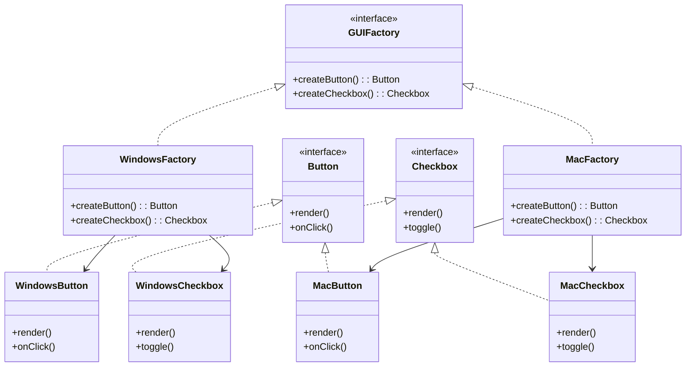

### 4. Builder Pattern

**Intent**: Constructs complex objects step by step.

**Real-world Example**: Building a house with different components.

```java
// Product
class House {
    private String foundation;
    private String structure;
    private String roof;
    private String interior;
    private boolean hasGarage;
    private boolean hasGarden;
    
    public void setFoundation(String foundation) { this.foundation = foundation; }
    public void setStructure(String structure) { this.structure = structure; }
    public void setRoof(String roof) { this.roof = roof; }
    public void setInterior(String interior) { this.interior = interior; }
    public void setHasGarage(boolean hasGarage) { this.hasGarage = hasGarage; }
    public void setHasGarden(boolean hasGarden) { this.hasGarden = hasGarden; }
    
    @Override
    public String toString() {
        return "House{" +
                "foundation='" + foundation + '\'' +
                ", structure='" + structure + '\'' +
                ", roof='" + roof + '\'' +
                ", interior='" + interior + '\'' +
                ", hasGarage=" + hasGarage +
                ", hasGarden=" + hasGarden +
                '}';
    }
}

// Builder interface
interface HouseBuilder {
    void buildFoundation();
    void buildStructure();
    void buildRoof();
    void buildInterior();
    void buildGarage();
    void buildGarden();
    House getHouse();
}

// Concrete Builder
class ConcreteHouseBuilder implements HouseBuilder {
    private House house;
    
    public ConcreteHouseBuilder() {
        this.house = new House();
    }
    
    public void buildFoundation() { house.setFoundation("Concrete Foundation"); }
    public void buildStructure() { house.setStructure("Concrete Structure"); }
    public void buildRoof() { house.setRoof("Concrete Roof"); }
    public void buildInterior() { house.setInterior("Modern Interior"); }
    public void buildGarage() { house.setHasGarage(true); }
    public void buildGarden() { house.setHasGarden(true); }
    public House getHouse() { return house; }
}

// Director
class HouseDirector {
    private HouseBuilder builder;
    
    public HouseDirector(HouseBuilder builder) {
        this.builder = builder;
    }
    
    public void buildMinimalHouse() {
        builder.buildFoundation();
        builder.buildStructure();
        builder.buildRoof();
        builder.buildInterior();
    }
    
    public void buildFullHouse() {
        builder.buildFoundation();
        builder.buildStructure();
        builder.buildRoof();
        builder.buildInterior();
        builder.buildGarage();
        builder.buildGarden();
    }
}

// Client
public class BuilderExample {
    public static void main(String[] args) {
        HouseBuilder builder = new ConcreteHouseBuilder();
        HouseDirector director = new HouseDirector(builder);
        
        director.buildFullHouse();
        House house = builder.getHouse();
        System.out.println(house);
    }
}
```

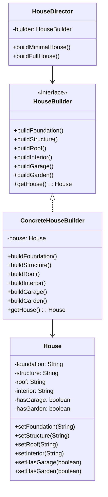

### 5. Prototype Pattern

**Intent**: Creates objects by cloning existing instances.

**Real-world Example**: Creating document templates by copying existing documents.

```java
// Prototype interface
interface DocumentPrototype extends Cloneable {
    DocumentPrototype clone();
    void customize(String content);
    void display();
}

// Concrete Prototype
class Document implements DocumentPrototype {
    private String title;
    private String content;
    private String template;
    
    public Document(String title, String template) {
        this.title = title;
        this.template = template;
        this.content = "Default content";
    }
    
    @Override
    public DocumentPrototype clone() {
        try {
            return (DocumentPrototype) super.clone();
        } catch (CloneNotSupportedException e) {
            throw new RuntimeException("Clone not supported", e);
        }
    }
    
    @Override
    public void customize(String content) {
        this.content = content;
    }
    
    @Override
    public void display() {
        System.out.println("Document: " + title);
        System.out.println("Template: " + template);
        System.out.println("Content: " + content);
        System.out.println("---");
    }
}

// Prototype Registry
class DocumentRegistry {
    private Map<String, DocumentPrototype> prototypes = new HashMap<>();
    
    public void registerPrototype(String key, DocumentPrototype prototype) {
        prototypes.put(key, prototype);
    }
    
    public DocumentPrototype getPrototype(String key) {
        DocumentPrototype prototype = prototypes.get(key);
        if (prototype != null) {
            return prototype.clone();
        }
        return null;
    }
}

// Client
public class PrototypeExample {
    public static void main(String[] args) {
        DocumentRegistry registry = new DocumentRegistry();
        
        // Register prototypes
        registry.registerPrototype("resume", new Document("Resume", "Professional Resume Template"));
        registry.registerPrototype("letter", new Document("Letter", "Business Letter Template"));
        
        // Create new documents from prototypes
        DocumentPrototype resume1 = registry.getPrototype("resume");
        resume1.customize("John Doe's Resume Content");
        resume1.display();
        
        DocumentPrototype resume2 = registry.getPrototype("resume");
        resume2.customize("Jane Smith's Resume Content");
        resume2.display();
        
        DocumentPrototype letter1 = registry.getPrototype("letter");
        letter1.customize("Dear Mr. Johnson, ...");
        letter1.display();
    }
}
```

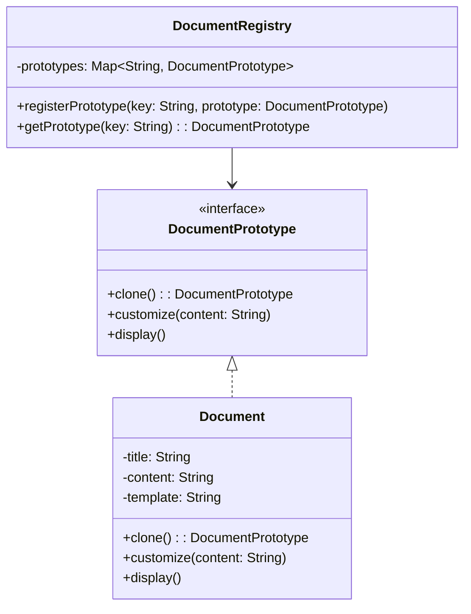

### 6. Singleton Pattern

**Intent**: Ensures a class has only one instance and provides global access to it.

**Real-world Example**: Database connection pool or application configuration.

```java
// Thread-safe Singleton using double-checked locking
class DatabaseConnection {
    private static volatile DatabaseConnection instance;
    private String connectionString;
    
    private DatabaseConnection() {
        // Simulate expensive initialization
        this.connectionString = "jdbc:mysql://localhost:3306/mydb";
        System.out.println("Database connection established");
    }
    
    public static DatabaseConnection getInstance() {
        if (instance == null) {
            synchronized (DatabaseConnection.class) {
                if (instance == null) {
                    instance = new DatabaseConnection();
                }
            }
        }
        return instance;
    }
    
    public void query(String sql) {
        System.out.println("Executing query: " + sql + " on " + connectionString);
    }
}

// Enum-based Singleton (preferred approach)
enum ConfigurationManager {
    INSTANCE;
    
    private String configValue;
    
    ConfigurationManager() {
        this.configValue = "Default Configuration";
        System.out.println("Configuration loaded");
    }
    
    public String getConfigValue() {
        return configValue;
    }
    
    public void setConfigValue(String value) {
        this.configValue = value;
    }
}

// Client
public class SingletonExample {
    public static void main(String[] args) {
        // Database connection example
        DatabaseConnection db1 = DatabaseConnection.getInstance();
        DatabaseConnection db2 = DatabaseConnection.getInstance();
        
        System.out.println("db1 == db2: " + (db1 == db2)); // true
        
        db1.query("SELECT * FROM users");
        db2.query("SELECT * FROM products");
        
        // Configuration manager example
        ConfigurationManager config1 = ConfigurationManager.INSTANCE;
        ConfigurationManager config2 = ConfigurationManager.INSTANCE;
        
        System.out.println("config1 == config2: " + (config1 == config2)); // true
        
        config1.setConfigValue("Production Configuration");
        System.out.println("Config value: " + config2.getConfigValue());
    }
}
```

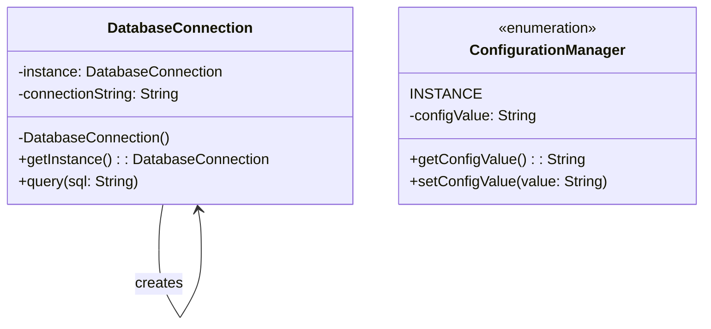

---

## Structural Design Patterns

Structural patterns deal with object composition and typically identify simple ways to realize relationships between different objects.

### 1. Adapter Pattern

**Intent**: Allows incompatible interfaces to work together.

**Real-world Example**: Using a power adapter to connect devices with different plug types.

```java
// Target interface (what client expects)
interface MediaPlayer {
    void play(String audioType, String fileName);
}

// Adaptee (existing class with incompatible interface)
class AdvancedMediaPlayer {
    public void playVlc(String fileName) {
        System.out.println("Playing vlc file: " + fileName);
    }
    
    public void playMp4(String fileName) {
        System.out.println("Playing mp4 file: " + fileName);
    }
}

// Adapter
class MediaAdapter implements MediaPlayer {
    private AdvancedMediaPlayer advancedPlayer;
    
    public MediaAdapter(String audioType) {
        if (audioType.equalsIgnoreCase("vlc") || audioType.equalsIgnoreCase("mp4")) {
            advancedPlayer = new AdvancedMediaPlayer();
        }
    }
    
    @Override
    public void play(String audioType, String fileName) {
        if (audioType.equalsIgnoreCase("vlc")) {
            advancedPlayer.playVlc(fileName);
        } else if (audioType.equalsIgnoreCase("mp4")) {
            advancedPlayer.playMp4(fileName);
        }
    }
}

// Client
class AudioPlayer implements MediaPlayer {
    private MediaAdapter mediaAdapter;
    
    @Override
    public void play(String audioType, String fileName) {
        if (audioType.equalsIgnoreCase("mp3")) {
            System.out.println("Playing mp3 file: " + fileName);
        } else if (audioType.equalsIgnoreCase("vlc") || audioType.equalsIgnoreCase("mp4")) {
            mediaAdapter = new MediaAdapter(audioType);
            mediaAdapter.play(audioType, fileName);
        } else {
            System.out.println("Invalid media. " + audioType + " format not supported");
        }
    }
}

// Usage
public class AdapterExample {
    public static void main(String[] args) {
        AudioPlayer audioPlayer = new AudioPlayer();
        
        audioPlayer.play("mp3", "song.mp3");
        audioPlayer.play("vlc", "movie.vlc");
        audioPlayer.play("mp4", "video.mp4");
        audioPlayer.play("avi", "movie.avi");
    }
}
```

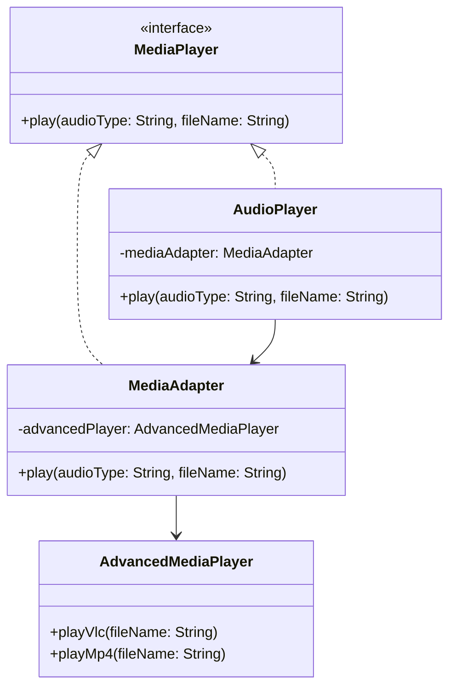

### 2. Bridge Pattern

**Intent**: Separates abstraction from implementation so both can vary independently.

**Real-world Example**: Remote controls that can work with different devices.

```java
// Implementation interface
interface Device {
    boolean isEnabled();
    void enable();
    void disable();
    int getVolume();
    void setVolume(int volume);
    int getChannel();
    void setChannel(int channel);
}

// Concrete implementations
class TV implements Device {
    private boolean on = false;
    private int volume = 30;
    private int channel = 1;
    
    @Override
    public boolean isEnabled() { return on; }
    
    @Override
    public void enable() { 
        on = true; 
        System.out.println("TV is now ON");
    }
    
    @Override
    public void disable() { 
        on = false; 
        System.out.println("TV is now OFF");
    }
    
    @Override
    public int getVolume() { return volume; }
    
    @Override
    public void setVolume(int volume) { 
        this.volume = volume; 
        System.out.println("TV volume set to " + volume);
    }
    
    @Override
    public int getChannel() { return channel; }
    
    @Override
    public void setChannel(int channel) { 
        this.channel = channel; 
        System.out.println("TV channel set to " + channel);
    }
}

class Radio implements Device {
    private boolean on = false;
    private int volume = 20;
    private int channel = 1;
    
    @Override
    public boolean isEnabled() { return on; }
    
    @Override
    public void enable() { 
        on = true; 
        System.out.println("Radio is now ON");
    }
    
    @Override
    public void disable() { 
        on = false; 
        System.out.println("Radio is now OFF");
    }
    
    @Override
    public int getVolume() { return volume; }
    
    @Override
    public void setVolume(int volume) { 
        this.volume = volume; 
        System.out.println("Radio volume set to " + volume);
    }
    
    @Override
    public int getChannel() { return channel; }
    
    @Override
    public void setChannel(int channel) { 
        this.channel = channel; 
        System.out.println("Radio station set to " + channel);
    }
}

// Abstraction
class RemoteControl {
    protected Device device;
    
    public RemoteControl(Device device) {
        this.device = device;
    }
    
    public void togglePower() {
        if (device.isEnabled()) {
            device.disable();
        } else {
            device.enable();
        }
    }
    
    public void volumeDown() {
        device.setVolume(device.getVolume() - 10);
    }
    
    public void volumeUp() {
        device.setVolume(device.getVolume() + 10);
    }
    
    public void channelDown() {
        device.setChannel(device.getChannel() - 1);
    }
    
    public void channelUp() {
        device.setChannel(device.getChannel() + 1);
    }
}

// Refined Abstraction
class AdvancedRemoteControl extends RemoteControl {
    public AdvancedRemoteControl(Device device) {
        super(device);
    }
    
    public void mute() {
        device.setVolume(0);
        System.out.println("Device muted");
    }
}

// Client
public class BridgeExample {
    public static void main(String[] args) {
        TV tv = new TV();
        RemoteControl remote = new RemoteControl(tv);
        
        remote.togglePower();
        remote.volumeUp();
        remote.channelUp();
        
        Radio radio = new Radio();
        AdvancedRemoteControl advancedRemote = new AdvancedRemoteControl(radio);
        
        advancedRemote.togglePower();
        advancedRemote.volumeUp();
        advancedRemote.mute();
    }
}
```

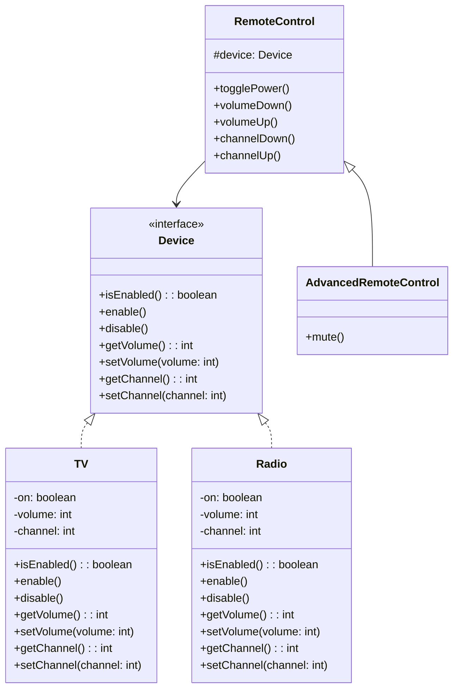

### 3. Composite Pattern

**Intent**: Composes objects into tree structures to represent part-whole hierarchies.

**Real-world Example**: File system with files and directories.

```java
// Component interface
interface FileSystemComponent {
    void showDetails();
    int getSize();
}

// Leaf
class File implements FileSystemComponent {
    private String name;
    private int size;
    
    public File(String name, int size) {
        this.name = name;
        this.size = size;
    }
    
    @Override
    public void showDetails() {
        System.out.println("File: " + name + " (Size: " + size + " KB)");
    }
    
    @Override
    public int getSize() {
        return size;
    }
}

// Composite
class Directory implements FileSystemComponent {
    private String name;
    private List<FileSystemComponent> components = new ArrayList<>();
    
    public Directory(String name) {
        this.name = name;
    }
    
    public void addComponent(FileSystemComponent component) {
        components.add(component);
    }
    
    public void removeComponent(FileSystemComponent component) {
        components.remove(component);
    }
    
    @Override
    public void showDetails() {
        System.out.println("Directory: " + name);
        for (FileSystemComponent component : components) {
            component.showDetails();
        }
    }
    
    @Override
    public int getSize() {
        int totalSize = 0;
        for (FileSystemComponent component : components) {
            totalSize += component.getSize();
        }
        return totalSize;
    }
}

// Client
public class CompositeExample {
    public static void main(String[] args) {
        // Create files
        File file1 = new File("document.txt", 100);
        File file2 = new File("photo.jpg", 500);
        File file3 = new File("video.mp4", 1000);
        
        // Create directories
        Directory rootDir = new Directory("Root");
        Directory documentsDir = new Directory("Documents");
        Directory mediaDir = new Directory("Media");
        
        // Build the file system structure
        documentsDir.addComponent(file1);
        
        mediaDir.addComponent(file2);
        mediaDir.addComponent(file3);
        
        rootDir.addComponent(documentsDir);
        rootDir.addComponent(mediaDir);
        
        // Display the structure
        rootDir.showDetails();
        System.out.println("Total size: " + rootDir.getSize() + " KB");
    }
}
```

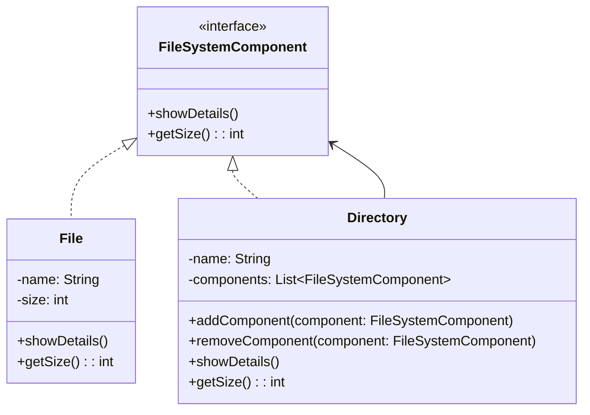

### 4. Decorator Pattern

**Intent**: Adds new functionality to objects dynamically without altering their structure.

**Real-world Example**: Adding toppings to a pizza or features to a car.

```java
// Component interface
interface Coffee {
    String getDescription();
    double getCost();
}

// Concrete Component
class SimpleCoffee implements Coffee {
    @Override
    public String getDescription() {
        return "Simple Coffee";
    }
    
    @Override
    public double getCost() {
        return 2.0;
    }
}

// Base Decorator
abstract class CoffeeDecorator implements Coffee {
    protected Coffee coffee;
    
    public CoffeeDecorator(Coffee coffee) {
        this.coffee = coffee;
    }
    
    @Override
    public String getDescription() {
        return coffee.getDescription();
    }
    
    @Override
    public double getCost() {
        return coffee.getCost();
    }
}

// Concrete Decorators
class MilkDecorator extends CoffeeDecorator {
    public MilkDecorator(Coffee coffee) {
        super(coffee);
    }
    
    @Override
    public String getDescription() {
        return coffee.getDescription() + ", Milk";
    }
    
    @Override
    public double getCost() {
        return coffee.getCost() + 0.5;
    }
}

class SugarDecorator extends CoffeeDecorator {
    public SugarDecorator(Coffee coffee) {
        super(coffee);
    }
    
    @Override
    public String getDescription() {
        return coffee.getDescription() + ", Sugar";
    }
    
    @Override
    public double getCost() {
        return coffee.getCost() + 0.2;
    }
}

class WhippedCreamDecorator extends CoffeeDecorator {
    public WhippedCreamDecorator(Coffee coffee) {
        super(coffee);
    }
    
    @Override
    public String getDescription() {
        return coffee.getDescription() + ", Whipped Cream";
    }
    
    @Override
    public double getCost() {
        return coffee.getCost() + 0.7;
    }
}

// Client
public class DecoratorExample {
    public static void main(String[] args) {
        Coffee coffee = new SimpleCoffee();
        System.out.println(coffee.getDescription() + " - $" + coffee.getCost());
        
        coffee = new MilkDecorator(coffee);
        System.out.println(coffee.getDescription() + " - $" + coffee.getCost());
        
        coffee = new SugarDecorator(coffee);
        System.out.println(coffee.getDescription() + " - $" + coffee.getCost());
        
        coffee = new WhippedCreamDecorator(coffee);
        System.out.println(coffee.getDescription() + " - $" + coffee.getCost());
    }
}
```

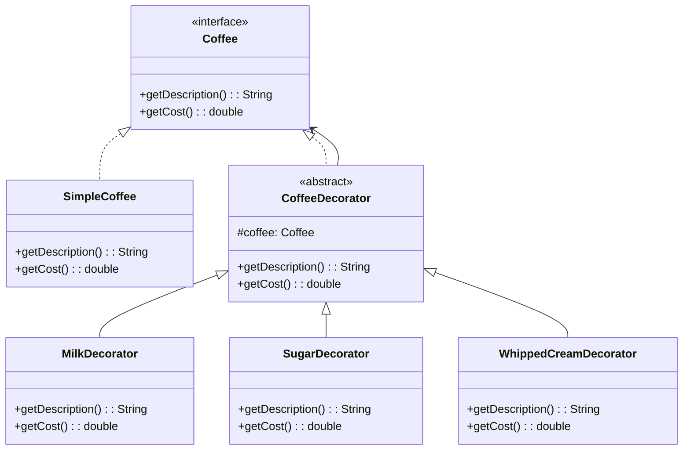

### 5. Facade Pattern

**Intent**: Provides a simplified interface to a complex subsystem.

**Real-world Example**: A home theater system with multiple components controlled by a single remote.

```java
// Subsystem classes
class DVDPlayer {
    public void on() { System.out.println("DVD Player is ON"); }
    public void off() { System.out.println("DVD Player is OFF"); }
    public void play(String movie) { System.out.println("Playing: " + movie); }
    public void stop() { System.out.println("DVD Player stopped"); }
}

class Amplifier {
    public void on() { System.out.println("Amplifier is ON"); }
    public void off() { System.out.println("Amplifier is OFF"); }
    public void setVolume(int volume) { System.out.println("Volume set to " + volume); }
}

class Projector {
    public void on() { System.out.println("Projector is ON"); }
    public void off() { System.out.println("Projector is OFF"); }
    public void setInput(String input) { System.out.println("Input set to " + input); }
}

class Lights {
    public void on() { System.out.println("Lights are ON"); }
    public void off() { System.out.println("Lights are OFF"); }
    public void dim(int level) { System.out.println("Lights dimmed to " + level + "%"); }
}

class Screen {
    public void up() { System.out.println("Screen is UP"); }
    public void down() { System.out.println("Screen is DOWN"); }
}

// Facade
class HomeTheaterFacade {
    private DVDPlayer dvdPlayer;
    private Amplifier amplifier;
    private Projector projector;
    private Lights lights;
    private Screen screen;
    
    public HomeTheaterFacade(DVDPlayer dvdPlayer, Amplifier amplifier, 
                           Projector projector, Lights lights, Screen screen) {
        this.dvdPlayer = dvdPlayer;
        this.amplifier = amplifier;
        this.projector = projector;
        this.lights = lights;
        this.screen = screen;
    }
    
    public void watchMovie(String movie) {
        System.out.println("Get ready to watch a movie...");
        lights.dim(10);
        screen.down();
        projector.on();
        projector.setInput("DVD");
        amplifier.on();
        amplifier.setVolume(15);
        dvdPlayer.on();
        dvdPlayer.play(movie);
    }
    
    public void endMovie() {
        System.out.println("Shutting down movie theater...");
        dvdPlayer.stop();
        dvdPlayer.off();
        amplifier.off();
        projector.off();
        screen.up();
        lights.on();
    }
}

// Client
public class FacadeExample {
    public static void main(String[] args) {
        // Create subsystem components
        DVDPlayer dvdPlayer = new DVDPlayer();
        Amplifier amplifier = new Amplifier();
        Projector projector = new Projector();
        Lights lights = new Lights();
        Screen screen = new Screen();
        
        // Create facade
        HomeTheaterFacade homeTheater = new HomeTheaterFacade(
            dvdPlayer, amplifier, projector, lights, screen);
        
        // Use facade to control complex subsystem
        homeTheater.watchMovie("The Matrix");
        System.out.println();
        homeTheater.endMovie();
    }
}
```

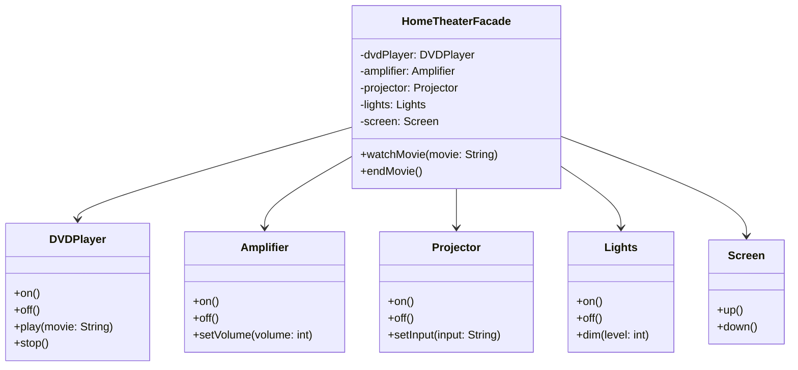

### 6. Flyweight Pattern

**Intent**: Uses sharing to support large numbers of fine-grained objects efficiently.

**Real-world Example**: Text editor that efficiently handles character formatting.

```java
// Flyweight interface
interface CharacterFlyweight {
    void display(int row, int column, String font, int size);
}

// Concrete Flyweight
class Character implements CharacterFlyweight {
    private char character; // Intrinsic state
    
    public Character(char character) {
        this.character = character;
    }
    
    @Override
    public void display(int row, int column, String font, int size) {
        System.out.println("Character '" + character + "' at (" + row + "," + column + 
                         ") with font: " + font + ", size: " + size);
    }
}

// Flyweight Factory
class CharacterFactory {
    private static Map<java.lang.Character, CharacterFlyweight> flyweights = new HashMap<>();
    
    public static CharacterFlyweight getFlyweight(char character) {
        CharacterFlyweight flyweight = flyweights.get(character);
        if (flyweight == null) {
            flyweight = new Character(character);
            flyweights.put(character, flyweight);
            System.out.println("Created flyweight for character: " + character);
        }
        return flyweight;
    }
    
    public static int getCreatedFlyweights() {
        return flyweights.size();
    }
}

// Context
class CharacterContext {
    private int row;
    private int column;
    private String font;
    private int size;
    private CharacterFlyweight flyweight;
    
    public CharacterContext(int row, int column, String font, int size, char character) {
        this.row = row;
        this.column = column;
        this.font = font;
        this.size = size;
        this.flyweight = CharacterFactory.getFlyweight(character);
    }
    
    public void display() {
        flyweight.display(row, column, font, size);
    }
}

// Client
public class FlyweightExample {
    public static void main(String[] args) {
        List<CharacterContext> characters = new ArrayList<>();
        
        // Simulate a document with repeated characters
        String text = "HELLO WORLD";
        for (int i = 0; i < text.length(); i++) {
            char c = text.charAt(i);
            if (c != ' ') {
                characters.add(new CharacterContext(1, i, "Arial", 12, c));
            }
        }
        
        // Display all characters
        System.out.println("Displaying document:");
        for (CharacterContext character : characters) {
            character.display();
        }
        
        System.out.println("\nTotal flyweights created: " + CharacterFactory.getCreatedFlyweights());
        System.out.println("Total characters in document: " + characters.size());
    }
}
```

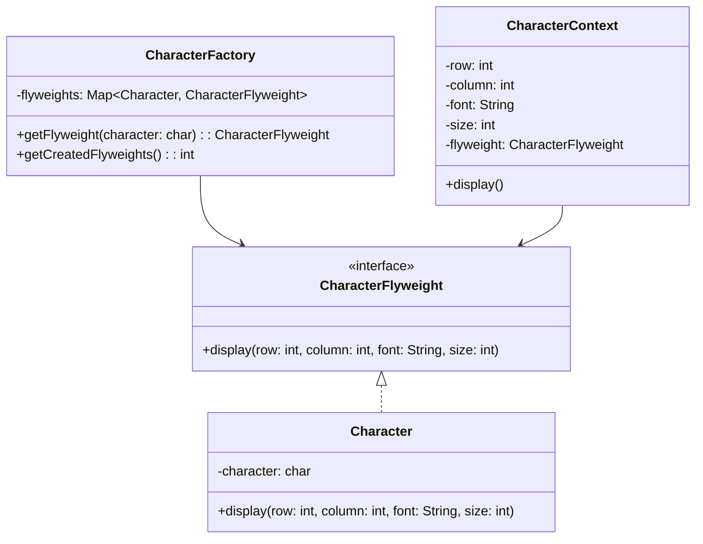

### 7. Proxy Pattern

**Intent**: Provides a placeholder or surrogate for another object to control access to it.

**Real-world Example**: A virtual proxy for loading large images or a protection proxy for access control.

```java
// Subject interface
interface Image {
    void display();
}

// Real Subject
class RealImage implements Image {
    private String filename;
    
    public RealImage(String filename) {
        this.filename = filename;
        loadFromDisk();
    }
    
    private void loadFromDisk() {
        System.out.println("Loading image: " + filename);
        // Simulate expensive loading operation
        try {
            Thread.sleep(1000);
        } catch (InterruptedException e) {
            Thread.currentThread().interrupt();
        }
    }
    
    @Override
    public void display() {
        System.out.println("Displaying image: " + filename);
    }
}

// Proxy
class ImageProxy implements Image {
    private String filename;
    private RealImage realImage;
    
    public ImageProxy(String filename) {
        this.filename = filename;
    }
    
    @Override
    public void display() {
        if (realImage == null) {
            realImage = new RealImage(filename);
        }
        realImage.display();
    }
}

// Protection Proxy example
interface BankAccount {
    void withdraw(double amount);
    void deposit(double amount);
    double getBalance();
}

class RealBankAccount implements BankAccount {
    private double balance;
    
    public RealBankAccount(double initialBalance) {
        this.balance = initialBalance;
    }
    
    @Override
    public void withdraw(double amount) {
        if (amount <= balance) {
            balance -= amount;
            System.out.println("Withdrew $" + amount + ". Balance: $" + balance);
        } else {
            System.out.println("Insufficient funds!");
        }
    }
    
    @Override
    public void deposit(double amount) {
        balance += amount;
        System.out.println("Deposited $" + amount + ". Balance: $" + balance);
    }
    
    @Override
    public double getBalance() {
        return balance;
    }
}

class BankAccountProxy implements BankAccount {
    private RealBankAccount realAccount;
    private String userRole;
    
    public BankAccountProxy(RealBankAccount realAccount, String userRole) {
        this.realAccount = realAccount;
        this.userRole = userRole;
    }
    
    @Override
    public void withdraw(double amount) {
        if (userRole.equals("OWNER") || userRole.equals("ADMIN")) {
            realAccount.withdraw(amount);
        } else {
            System.out.println("Access denied: You don't have permission to withdraw");
        }
    }
    
    @Override
    public void deposit(double amount) {
        realAccount.deposit(amount);
    }
    
    @Override
    public double getBalance() {
        if (userRole.equals("OWNER") || userRole.equals("ADMIN")) {
            return realAccount.getBalance();
        } else {
            System.out.println("Access denied: You don't have permission to view balance");
            return 0;
        }
    }
}

// Client
public class ProxyExample {
    public static void main(String[] args) {
        System.out.println("=== Virtual Proxy Example ===");
        Image image1 = new ImageProxy("photo1.jpg");
        Image image2 = new ImageProxy("photo2.jpg");
        
        // Images are loaded only when displayed
        image1.display();
        image1.display(); // No loading this time
        
        image2.display();
        
        System.out.println("\n=== Protection Proxy Example ===");
        RealBankAccount account = new RealBankAccount(1000);
        
        BankAccount ownerProxy = new BankAccountProxy(account, "OWNER");
        BankAccount guestProxy = new BankAccountProxy(account, "GUEST");
        
        System.out.println("Owner operations:");
        ownerProxy.deposit(500);
        ownerProxy.withdraw(200);
        System.out.println("Balance: $" + ownerProxy.getBalance());
        
        System.out.println("\nGuest operations:");
        guestProxy.deposit(100);
        guestProxy.withdraw(50);
        System.out.println("Balance: $" + guestProxy.getBalance());
    }
}
```

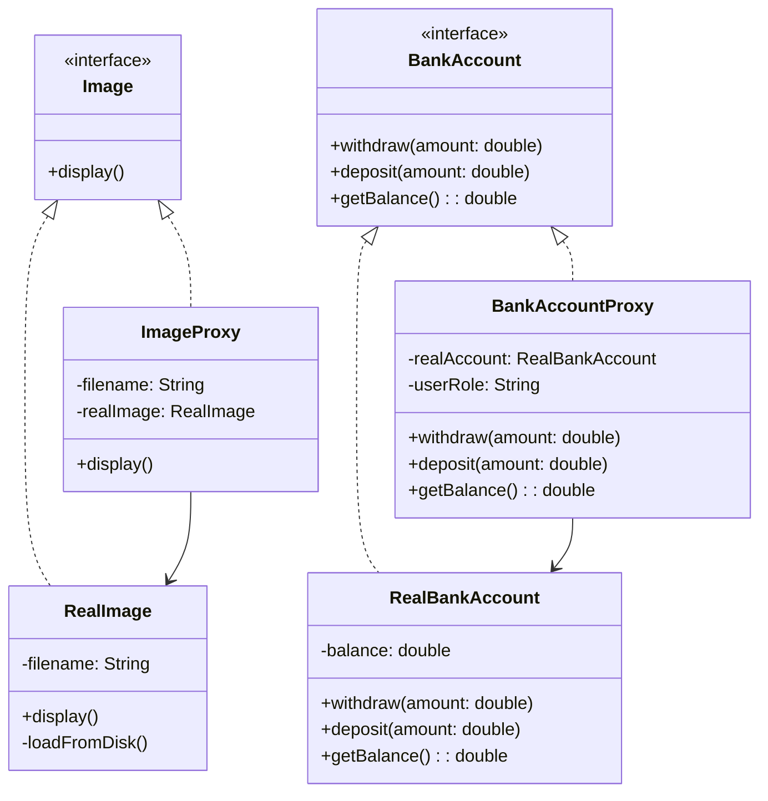

---

## Behavioral Design Patterns

Behavioral patterns focus on communication between objects and the assignment of responsibilities between objects.

### 1. Chain of Responsibility Pattern

**Intent**: Passes requests along a chain of handlers until one handles it.

**Real-world Example**: Support ticket system with different levels of support.

```java
// Handler interface
abstract class SupportHandler {
    protected SupportHandler nextHandler;
    
    public void setNextHandler(SupportHandler nextHandler) {
        this.nextHandler = nextHandler;
    }
    
    public abstract void handleRequest(SupportTicket ticket);
}

// Request class
class SupportTicket {
    private String issue;
    private Priority priority;
    
    public SupportTicket(String issue, Priority priority) {
        this.issue = issue;
        this.priority = priority;
    }
    
    public String getIssue() { return issue; }
    public Priority getPriority() { return priority; }
    
    enum Priority {
        LOW, MEDIUM, HIGH, CRITICAL
    }
}

// Concrete Handlers
class Level1Support extends SupportHandler {
    @Override
    public void handleRequest(SupportTicket ticket) {
        if (ticket.getPriority() == SupportTicket.Priority.LOW) {
            System.out.println("Level 1 Support handling: " + ticket.getIssue());
        } else if (nextHandler != null) {
            System.out.println("Level 1 Support escalating ticket");
            nextHandler.handleRequest(ticket);
        }
    }
}

class Level2Support extends SupportHandler {
    @Override
    public void handleRequest(SupportTicket ticket) {
        if (ticket.getPriority() == SupportTicket.Priority.MEDIUM) {
            System.out.println("Level 2 Support handling: " + ticket.getIssue());
        } else if (nextHandler != null) {
            System.out.println("Level 2 Support escalating ticket");
            nextHandler.handleRequest(ticket);
        }
    }
}

class Level3Support extends SupportHandler {
    @Override
    public void handleRequest(SupportTicket ticket) {
        if (ticket.getPriority() == SupportTicket.Priority.HIGH) {
            System.out.println("Level 3 Support handling: " + ticket.getIssue());
        } else if (nextHandler != null) {
            System.out.println("Level 3 Support escalating ticket");
            nextHandler.handleRequest(ticket);
        }
    }
}

class ManagerSupport extends SupportHandler {
    @Override
    public void handleRequest(SupportTicket ticket) {
        System.out.println("Manager handling critical issue: " + ticket.getIssue());
    }
}

// Client
public class ChainOfResponsibilityExample {
    public static void main(String[] args) {
        // Create the chain
        SupportHandler level1 = new Level1Support();
        SupportHandler level2 = new Level2Support();
        SupportHandler level3 = new Level3Support();
        SupportHandler manager = new ManagerSupport();
        
        level1.setNextHandler(level2);
        level2.setNextHandler(level3);
        level3.setNextHandler(manager);
        
        // Handle different tickets
        SupportTicket[] tickets = {
            new SupportTicket("Password reset", SupportTicket.Priority.LOW),
            new SupportTicket("Software installation", SupportTicket.Priority.MEDIUM),
            new SupportTicket("Database corruption", SupportTicket.Priority.HIGH),
            new SupportTicket("Server down", SupportTicket.Priority.CRITICAL)
        };
        
        for (SupportTicket ticket : tickets) {
            System.out.println("Processing ticket: " + ticket.getIssue());
            level1.handleRequest(ticket);
            System.out.println("---");
        }
    }
}
```

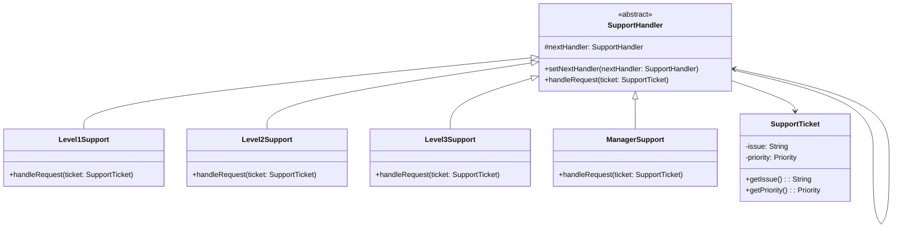

### 2. Command Pattern

**Intent**: Encapsulates a request as an object, allowing you to parameterize clients with different requests.

**Real-world Example**: Remote control with undo functionality.

```java
// Command interface
interface Command {
    void execute();
    void undo();
}

// Receiver classes
class Light {
    private boolean isOn = false;
    
    public void turnOn() {
        isOn = true;
        System.out.println("Light is ON");
    }
    
    public void turnOff() {
        isOn = false;
        System.out.println("Light is OFF");
    }
    
    public boolean isOn() {
        return isOn;
    }
}

class Fan {
    private int speed = 0; // 0 = off, 1-3 = speeds
    
    public void setSpeed(int speed) {
        this.speed = speed;
        if (speed == 0) {
            System.out.println("Fan is OFF");
        } else {
            System.out.println("Fan speed set to " + speed);
        }
    }
    
    public int getSpeed() {
        return speed;
    }
}

// Concrete Commands
class LightOnCommand implements Command {
    private Light light;
    
    public LightOnCommand(Light light) {
        this.light = light;
    }
    
    @Override
    public void execute() {
        light.turnOn();
    }
    
    @Override
    public void undo() {
        light.turnOff();
    }
}

class LightOffCommand implements Command {
    private Light light;
    
    public LightOffCommand(Light light) {
        this.light = light;
    }
    
    @Override
    public void execute() {
        light.turnOff();
    }
    
    @Override
    public void undo() {
        light.turnOn();
    }
}

class FanSpeedCommand implements Command {
    private Fan fan;
    private int speed;
    private int previousSpeed;
    
    public FanSpeedCommand(Fan fan, int speed) {
        this.fan = fan;
        this.speed = speed;
    }
    
    @Override
    public void execute() {
        previousSpeed = fan.getSpeed();
        fan.setSpeed(speed);
    }
    
    @Override
    public void undo() {
        fan.setSpeed(previousSpeed);
    }
}

// Null Object Pattern for empty slots
class NoCommand implements Command {
    @Override
    public void execute() {
        // Do nothing
    }
    
    @Override
    public void undo() {
        // Do nothing
    }
}

// Invoker
class RemoteControl {
    private Command[] onCommands;
    private Command[] offCommands;
    private Command undoCommand;
    
    public RemoteControl() {
        onCommands = new Command[7];
        offCommands = new Command[7];
        
        Command noCommand = new NoCommand();
        for (int i = 0; i < 7; i++) {
            onCommands[i] = noCommand;
            offCommands[i] = noCommand;
        }
        undoCommand = noCommand;
    }
    
    public void setCommand(int slot, Command onCommand, Command offCommand) {
        onCommands[slot] = onCommand;
        offCommands[slot] = offCommand;
    }
    
    public void onButtonPressed(int slot) {
        onCommands[slot].execute();
        undoCommand = onCommands[slot];
    }
    
    public void offButtonPressed(int slot) {
        offCommands[slot].execute();
        undoCommand = offCommands[slot];
    }
    
    public void undoButtonPressed() {
        undoCommand.undo();
    }
}

// Client
public class CommandExample {
    public static void main(String[] args) {
        // Create receivers
        Light livingRoomLight = new Light();
        Fan ceilingFan = new Fan();
        
        // Create commands
        LightOnCommand lightOn = new LightOnCommand(livingRoomLight);
        LightOffCommand lightOff = new LightOffCommand(livingRoomLight);
        FanSpeedCommand fanHigh = new FanSpeedCommand(ceilingFan, 3);
        FanSpeedCommand fanOff = new FanSpeedCommand(ceilingFan, 0);
        
        // Create invoker
        RemoteControl remote = new RemoteControl();
        
        // Set commands
        remote.setCommand(0, lightOn, lightOff);
        remote.setCommand(1, fanHigh, fanOff);
        
        // Test the remote
        System.out.println("Testing Remote Control:");
        remote.onButtonPressed(0);   // Light on
        remote.offButtonPressed(0);  // Light off
        remote.undoButtonPressed();  // Undo (light on)
        
        remote.onButtonPressed(1);   // Fan high
        remote.undoButtonPressed();  // Undo (fan off)
    }
}
```

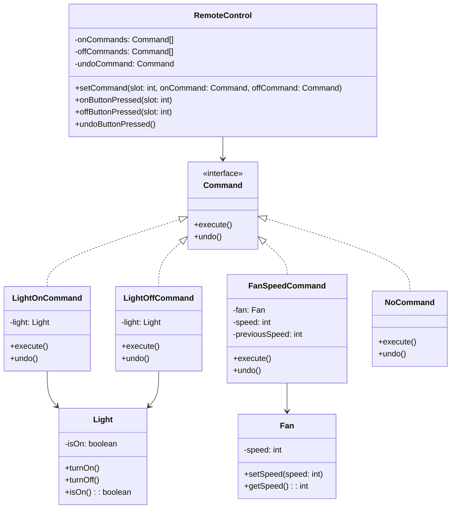

### 3. Iterator Pattern

**Intent**: Provides a way to access elements of a collection sequentially without exposing its underlying representation.

**Real-world Example**: Browsing through a playlist or a book's chapters.

```java
// Iterator interface
interface Iterator<T> {
    boolean hasNext();
    T next();
}

// Aggregate interface
interface Aggregate<T> {
    Iterator<T> createIterator();
}

// Concrete Iterator
class BookIterator implements Iterator<String> {
    private String[] books;
    private int position = 0;
    
    public BookIterator(String[] books) {
        this.books = books;
    }
    
    @Override
    public boolean hasNext() {
        return position < books.length && books[position] != null;
    }
    
    @Override
    public String next() {
        if (hasNext()) {
            return books[position++];
        }
        return null;
    }
}

// Concrete Aggregate
class BookCollection implements Aggregate<String> {
    private String[] books;
    private int count = 0;
    
    public BookCollection(int size) {
        books = new String[size];
    }
    
    public void addBook(String book) {
        if (count < books.length) {
            books[count++] = book;
        }
    }
    
    @Override
    public Iterator<String> createIterator() {
        return new BookIterator(books);
    }
}

// Alternative implementation with different data structure
class PlaylistIterator implements Iterator<String> {
    private List<String> songs;
    private int position = 0;
    
    public PlaylistIterator(List<String> songs) {
        this.songs = songs;
    }
    
    @Override
    public boolean hasNext() {
        return position < songs.size();
    }
    
    @Override
    public String next() {
        if (hasNext()) {
            return songs.get(position++);
        }
        return null;
    }
}

class Playlist implements Aggregate<String> {
    private List<String> songs = new ArrayList<>();
    
    public void addSong(String song) {
        songs.add(song);
    }
    
    @Override
    public Iterator<String> createIterator() {
        return new PlaylistIterator(songs);
    }
}

// Client
public class IteratorExample {
    public static void main(String[] args) {
        // Book collection example
        BookCollection library = new BookCollection(5);
        library.addBook("Design Patterns");
        library.addBook("Clean Code");
        library.addBook("Effective Java");
        library.addBook("Spring in Action");
        
        System.out.println("Library books:");
        Iterator<String
